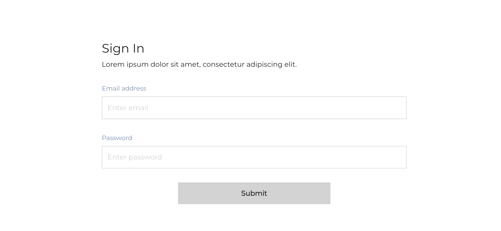

# Implementation Details

A simple data driven web application

# Technologies used
1. React
2. Typescript
3. Docker
4. SCSS
5. Bootstrap
## HOW TO RUN THE PROJECT

In the project directory, you can run:
### `npm install`
then

### `npm start`

### `Open http://localhost:3000 on your browser to view the project`

## To run the project with with docker after installing the dependencies
1. First create the image with `docker-compose -f docker-compose.prod.yml build`
2. The start the container with `docker run -p 80:80 --name contilio-frontend app-prod`
3. Open `http://localhost:80` on your browser to view the project.

## IMPLEMENTATION
1. The project has been grouped according to components
2. The components folder contain a button component, input component and a table component
3. We also have the pages folder that contains the login page and dashboard page
4. There's a route folder that helps with routing. It also contains a protected route component for authorization implementation
5. Pages -> Dashboard : Contains other components that were broken down to make the application scalable
6. The project styles were written with SCSS and bootstrap.
7. SCSS variables were declared for commonly used styles.
